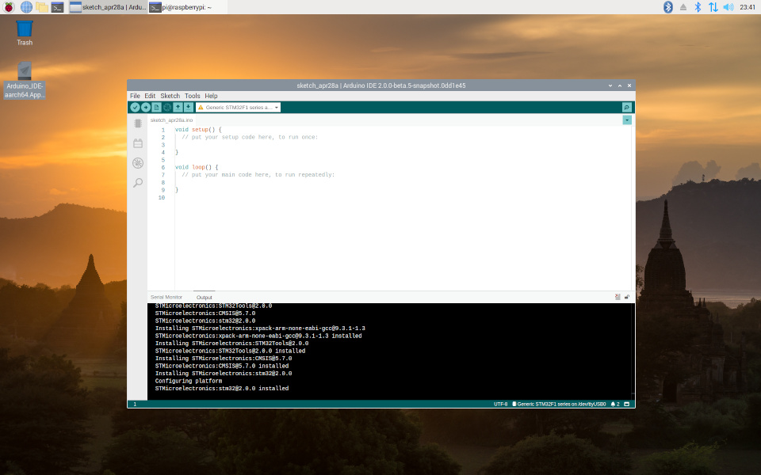

# Arduino_Tools for Raspberry

## Beta

[](https://github.com/koendv/Arduino_Tools/raw/master/images/screenshot.png))

Fork of STM32 upload tools for Arduino IDE v2 on raspberry pi os.

To use, install the following packages:
```
sudo apt-get install stlink-tools stm32flash dfu-util
```
Optionally install the following package:
```
sudo apt-get install stlink-gui
```

Start Arduino IDE 2.0.0. From the menu choose *File->Preferences*. In *Additional boards manager URLSs*, add the following url:

 ```https://raw.githubusercontent.com/koendv/BoardManagerFiles/master/package_stmicroelectronics_index.json```

This installs the board support package for STM32. In the dropdown box *Select Other Board & Port* you should now be able to select STM32 boards.

If you like this, maybe you want to buy me a cup of tea:

[](https://ko-fi.com/Q5Q03LPDQ)

## Compiling the IDE

 Binaries of arduino IDE 2.0.0 for raspberry can be downloaded [here](https://github.com/koendv/arduino-ide-raspberrypi). 